# Fractal 5 Pro

The Fractal 5 Pro is an open source benchtop multidirectional 5-axis 3D printer.

💻 An open-source 5-Axis slicer application was developed to go along with this printer. You can check out [the GitHub page for it here](https://github.com/fractalrobotics/Fractal-Cortex) to download it for free.

  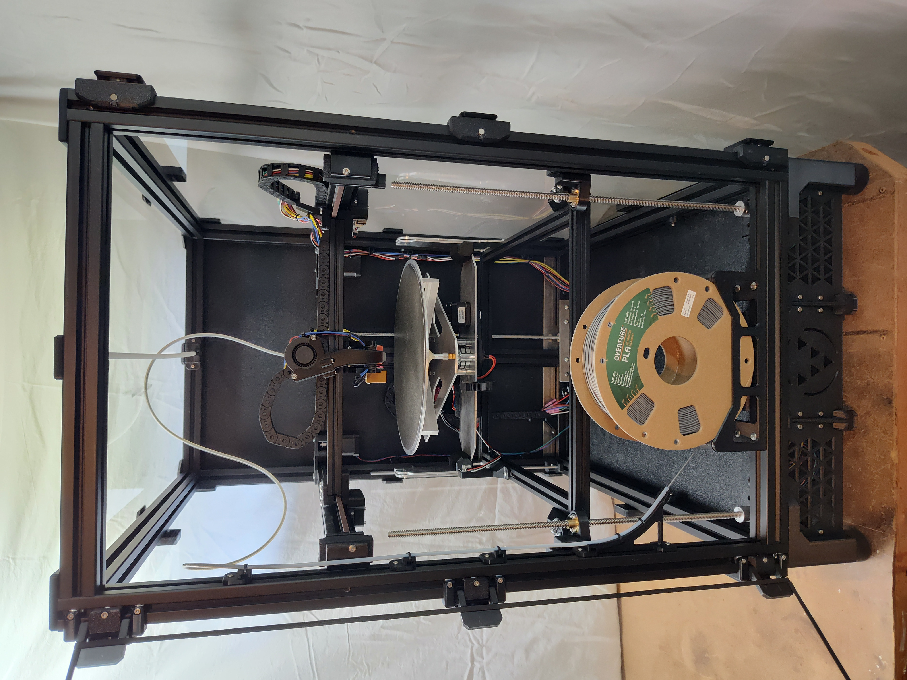

# 📐Design Overview
This printer is comprised of a combination of COTS parts, 3D printed parts, and custom machined parts. The BOM lists all required materials with links to purchase them. Excluding taxes and shipping costs, the total materials cost for the Fractal 5 Pro is about $1,900.

Several aspects of the design (such as the CoreXY system and triple lead-screw Z-axis) were inspired by the VORON Trident project, which is also licensed under GPLv3. This project complies with the GPLv3 license and is released under the same terms. I gratefully acknowledge VORON's contribution to the open hardware ecosystem.

**Gimbal**

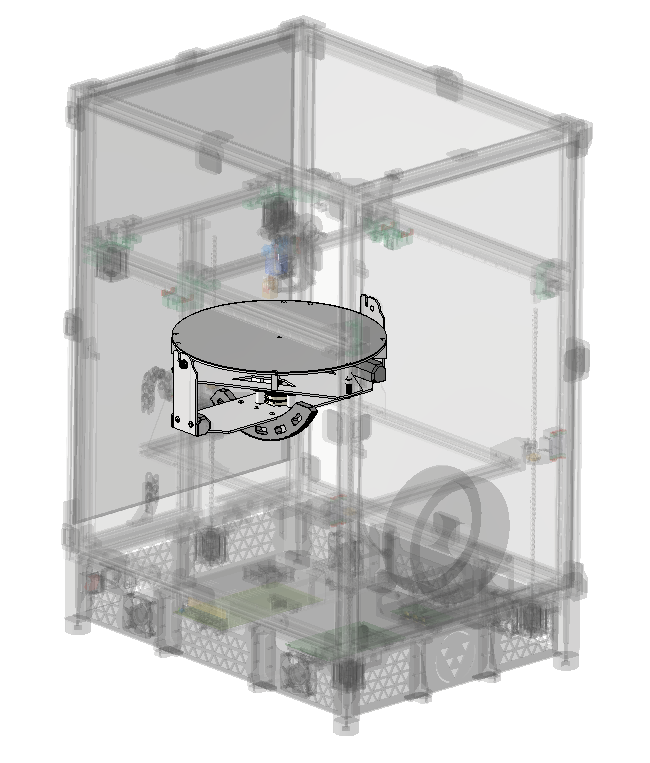

- The gimbal assembly includes the heated build plate, adjustable standoffs, A-axis shaft, bearings, A-axis belt drive, slip ring, and B-axis gear drive.

  

- The slip ring supplies power to and reads thermistor data from the build plate, allowing the A-axis to spin infinitely in either direction without wires getting tangled.
- The A-axis shaft is held in place with a spring-loaded bearing stack with a retention ring in-between the bearings. The bearing stack is centered using locating pins.
- A pulley with adjustable belt tension is used to drive the A-axis. This should be revised as stated in the future work section.
- The large B-axis gear with adjustable pinion placement is used to drive the B-axis.

  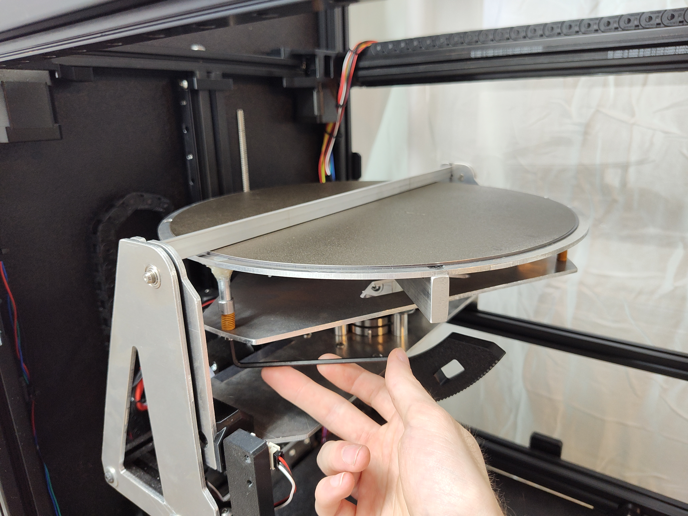

- The build surface is a magnetically removable PEI-coated spring steel sheet.
- Included with the printer is a leveling bar that can be used to calibrate the build surface to be coplanar with the B-axis. This step is critical to ensure axis alignment when performing coordinate transformations. To complete this calibration, the leveling bar must be placed into the slots on either side of the gimbal as shown above. There are three standoffs that position the build plate that can be adjusted using an allen key. The user should increase the height of each standoff until a slight scratching noise is heard when the build plate rotates past the leveling bar. The leveling bar must be removed when the printer is powered on. This step must be completed after the printer is first assembled, and must be completed again any time the printer is moved.

**Z-Axis Elevator**

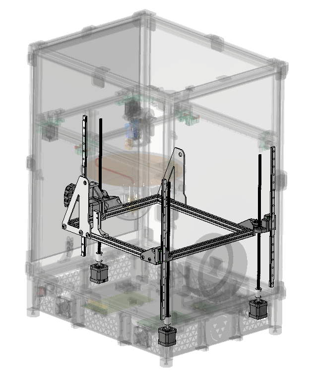

- Similar to the VORON Trident, three independently driven lead screws are used to actuate the Z-axis.
- Spherical bearings are used to avoid binding and allow the elevator frame to pivot for auto-bed leveling.
- Each of the three elevator pivot locations are attached to a carriage that rides vertically along a linear rail for added stability.
- Sensorless homing is used to detect the upper range of motion of each lead screw.

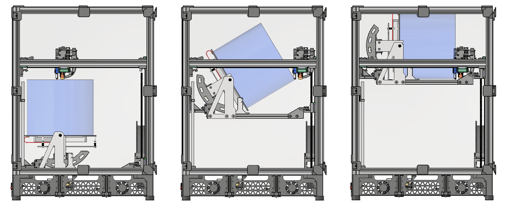

- The range of motion for the Z-axis elevator is such that the printhead can reach any point within the build volume for any orientation of the gimbal with some additional margin in every direction. The image above shows examples of extreme positions with a blue cylinder representing the build volume.

**Printhead**

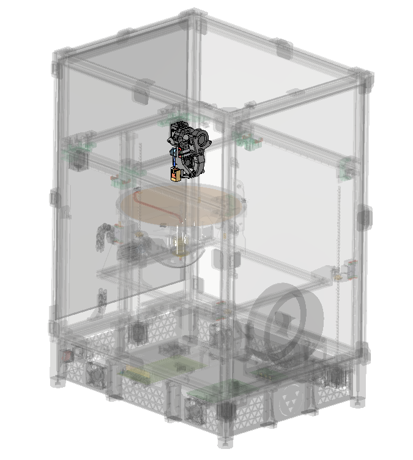

- The printhead was designed so that when the B-axis is tilted 90°, the nozzle can move extremely close to the build plate. Designing the printhead this way increases the amount of design freedom the user has over where they can define [slicing directions](https://github.com/fractalrobotics/Fractal-Cortex?tab=readme-ov-file#user-guide). Due to [the differences between multidirectional printing and non-planar printing](https://github.com/fractalrobotics/Fractal-Cortex?tab=readme-ov-file#user-guide), the printhead only needs to approach the build plate closely on one side as shown in the image below; the remainder of the printhead does not have any other special geometry constraints.

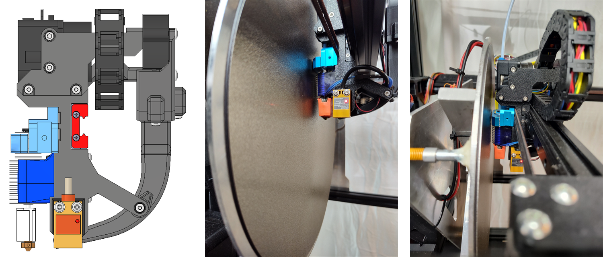

- The printhead uses a BondTech LGX Lite V2 direct drive extruder due to its compact size and ideal shape for this application.
- An E3D Volcano hotend is used so that the high flow rate of the nozzle can keep up with the high speed capability of the coreXY gantry.
- A radial fan and swept duct is used for part cooling and the stock E3D axial fan is used to cool the hotend heat sink.
- An inductive probe is used both for auto bed leveling and for calibrating to the center of the build plate. Due to the difficult to characterize electromagnetic field shape of the inductive probe, it was tested and decided to have low reliability for center calibration. The inductive probe should still be used for auto bed leveling, but another type of sensor should be used for center calibration as is discussed in the future work section.

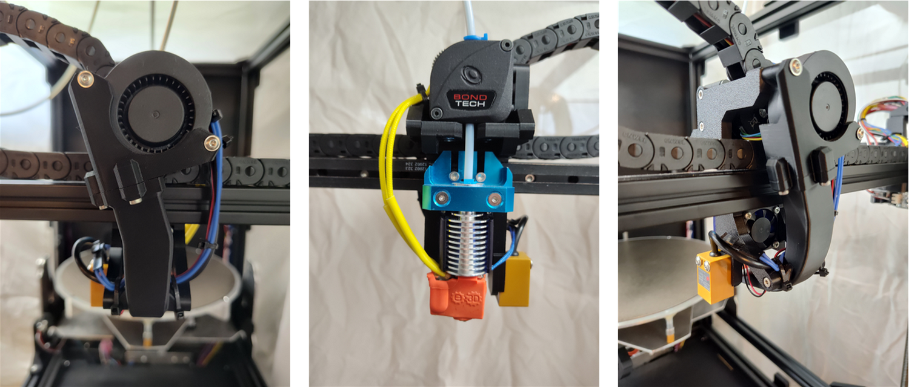

**CoreXY Gantry**

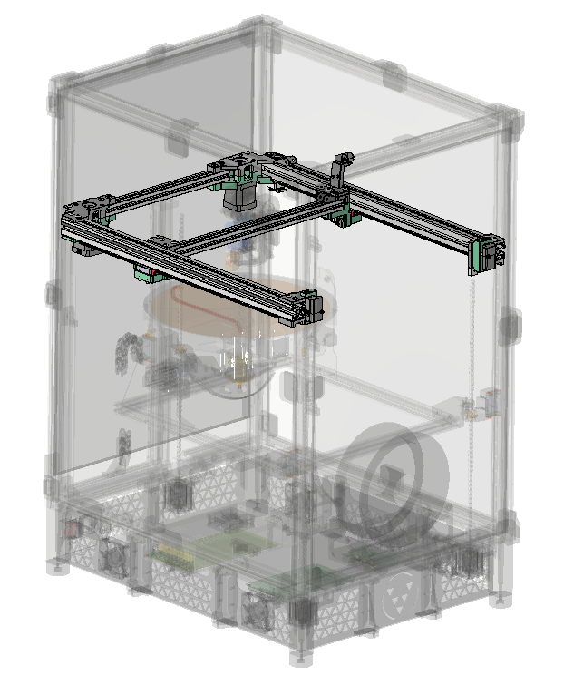

- The CoreXY gantry system is similar to the one used on the VORON Trident with some important differences that are bulleted below:
  - The belt system was adapted to fit the larger 30x30mm aluminum frame extrusions of the Fractal 5 Pro.
  - The belts attach to the printhead on the rear side of the gantry to be compatible with the unique printhead design.
- CoreXY motion systems provide more reliable prints and allow for higher print speeds compared to bedslinger motion systems.

**Frame & Enclosure**

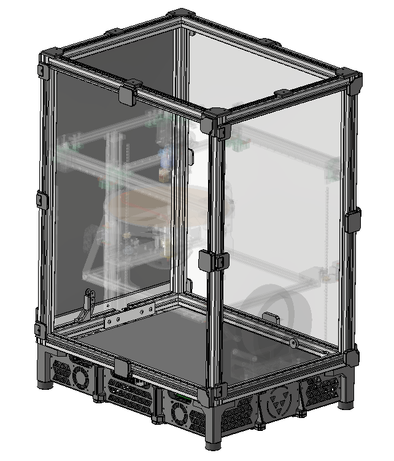

  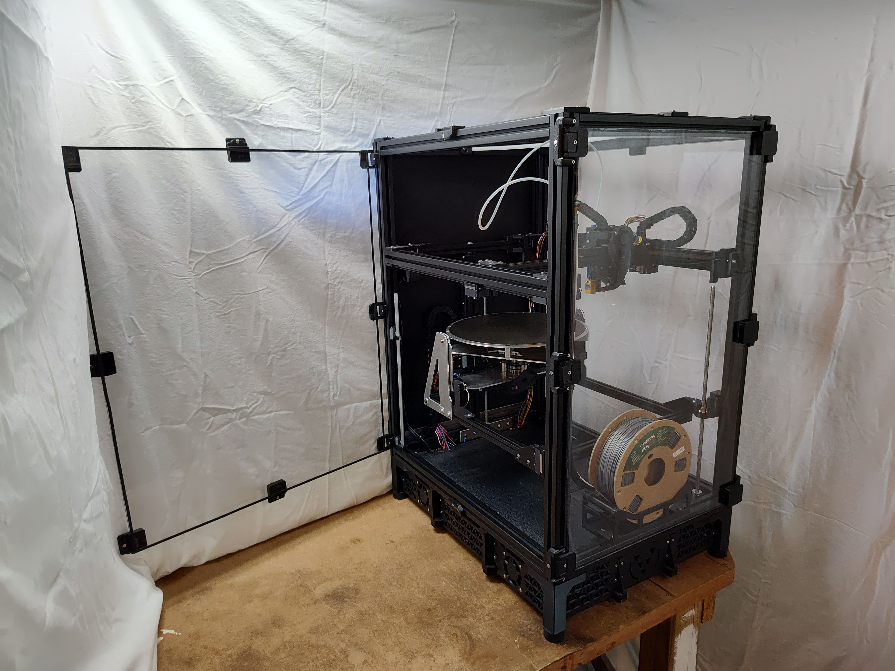

**Electronics**

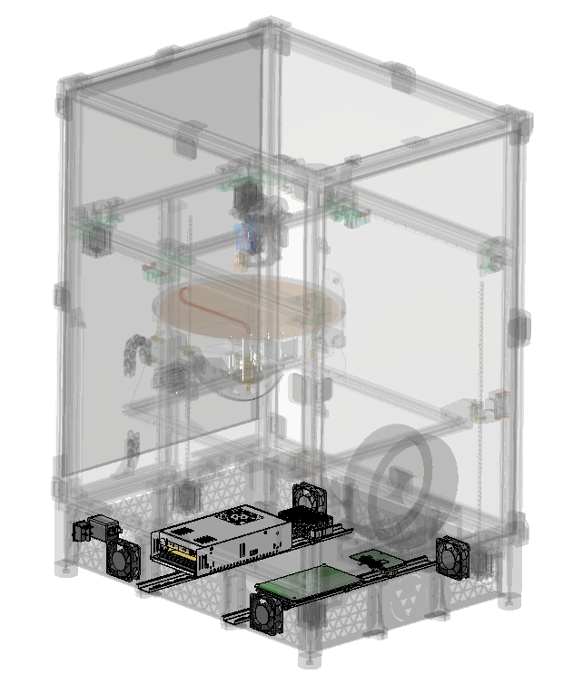

- A Raspberry Pi is used to run the firmware and an Octopus Pro is used to control the circuit elements.

  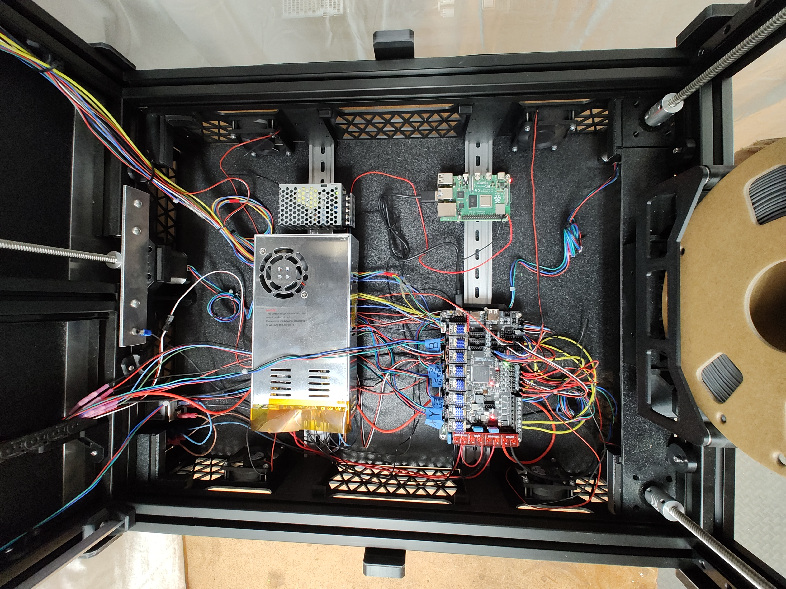

**Firmware**

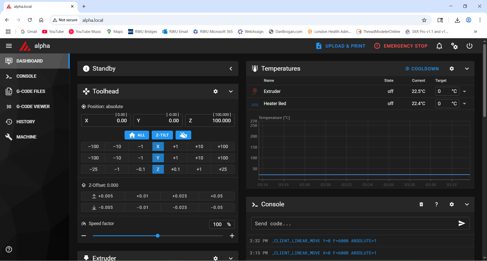

- The Fractal 5 Pro uses Klipper firmware.
- This allows the user to interface with the printer wirelessly on their laptop from anywhere on their local network.
- The custom CFG file and saved variables file required to run the Fractal 5 Pro are located [here](https://github.com/fractalrobotics/Fractal-5-Pro/tree/main/Firmware).
- The [KIAUH](https://github.com/dw-0/kiauh) helper can be used to install Klipper.

---

# Project Motivation
This project was motivated by the **Fractal Robotics** vision: **To accelerate the development of mechanical solutions.** In support of this vision, this project aims to address the observed gap between the limitations of 3-axis FDM and the inaccessibility of current 5-axis FDM.

**📋Limitations of 3-Axis FDM**
  - Part strength is limited due to the direction of printing
    - Parts often fail when forces are applied parallel to the direction of layer lines
    - Stacking layers in only one direction limits design freedom
  - Overhangs require support structures
    - The process of removing supports often damages or destroys a part
    - Support structures waste material

**🔒Inaccessibility of Existing 5-Axis FDM**
  - Options for existing 5-Axis slicer applications are limited
    - Most non-planar slicing requires significant training on advanced CAM softwares and are not compatible with all geometries
  - Most commercially available 5-Axis 3D printers are huge and expensive

**🌉Bridging the Gap**

The observations listed above prompted an investigation into the needs of 3D printing practitioners across different industries. The result was the development of both the [Fractal Cortex](https://github.com/fractalrobotics/Fractal-Cortex) slicer and the Fractal 5 Pro printer.

# 🔎Product-Market Fit
Dozens of potential customers were interviewed to determine 3D printing needs, budgets, and expectations across different industries. This process helped inform and focus design decisions.

**🔑Key Customer Needs Translated to Design Decisions**

My response to the customer interviews was to design an accessible product package (hardware & software) that addressed the shortfalls of 3-axis FDM while still being easy to use.

  - Control over orthotropic strength, less waste material, reduced post-processing risk ➡️ 5-Axis
  - Ease of maintenance, clean setup ➡️ FDM, removable build surface, full-size front and side doors
  - Reduced training time ➡️ Intuitive multidirectional slicer software, backwards compatibility with 3-Axis 3D printing
  - Printing complex parts ➡️ Compatible with any 3D geometry
  - High reliability ➡️ CoreXY gantry, auto bed leveling, rigid 30x30mm aluminum frame extrusions
  - Expansive material compatibility ➡️ Direct Drive Extruder, heated build plate, fully enclosed
  - Large print volume ➡️ 300mm Diameter x 250mm build height

---

# Note From the Author to the Community
Hi, my name is Dan Brogan, and I spent 3 years (2022-2025) bootstrapping a startup called Fractal Robotics while working part time jobs. Over those 3 years, I developed technical acumen in end-to-end robotics product development, improved my communication skills, and learned a great deal about what goes into running a startup. 

My career goal has always been and continues to be **to contribute to society through technology in a way that has a positive impact**. That goal was translated into the vision of Fractal Robotics, which is "to accelerate the development of mechanical solutions".

At this point, I am unable to continue volunteering my full effort into this project. While I won't be stepping back entirely, I have decided the best course of action is to release both the [Fractal Cortex](https://github.com/fractalrobotics/Fractal-Cortex) slicer and designs for the Fractal 5 Pro under an open source license so that others can learn from, build upon, and contribute to it. 

Open sourcing this project allows me to stay true to the original vision of Fractal Robotics. By sharing my work, I hope to support researchers, developers, educators, and makers exploring similar ideas.

I'm excited to see where others take this work next.

Feel free to [connect with me](https://www.linkedin.com/in/dan-brogan-442b27128/) on LinkedIn. 

---

# FAQ's

**What does this printer do that others can't?**
- It provides all of the following in one product: high reliability, stronger parts, more design freedom, less waste material, large build volume, intuitive user experience, and ease of maintenance at a relatively affordable price.

**What is multidirectional 5-axis 3D printing?**
- Multidirectional 5-axis slicing is a technique in which a 3D model is divided into sub-volumes (chunks) and each chunk is sliced in a different direction. This allows users to define multiple slicing directions for a given part. The result is a gcode file with toolpath instructions that include reorienting the part relative to the printhead after each successive chunk is printed. This approach is distinct from non-planar slicing, which modifies the surface of each layer to follow the curvature of the model's shape.

  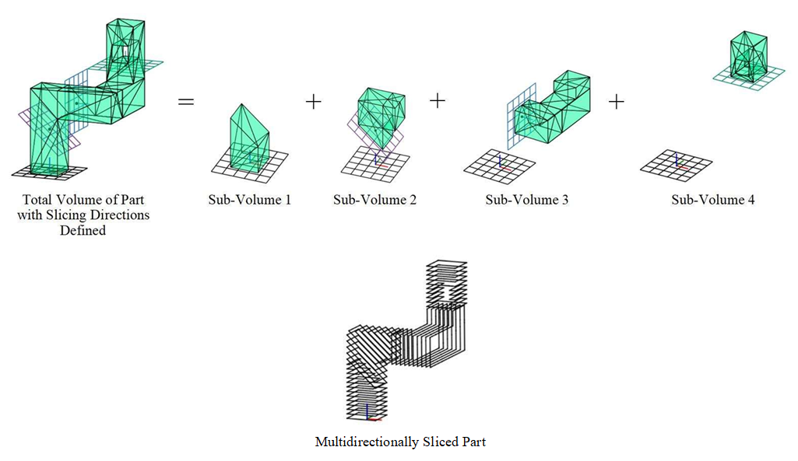

**Why focus on multidirectional slicing instead of non-planar printing?**
- Non-planar slicing often requires significant training in advanced CAM software and tends to be computationally expensive. In contrast, multidirectional slicing provides many of the same benefits of 5-axis 3D printing - such as directional strength control and reduced support requirements - within a more accessable and familiar workflow. 

- From a hardware standpoint, multidirectional 5-axis 3D printers avoid an important mechanical limitation of non-planar 5-axis 3D printers. Since they don't require the printhead to be long and thin to achieve tight angles, multidirectional printers can achieve much higher print speeds with far less vibration. That said, non-planar slicing is an exciting and evolving area of research, and ongoing developments will hopefully make that method more accessible as well.

**Why FDM? Why not SLA or SLS?**
- FDM printers are low maintenance, have an easy & clean setup, and are compatible with a large selection of affordable materials. Further, since FDM is the printing method that is most impacted by orthotropy, it stands to benefit the most from 5-axis technology.

**Why Direct Drive instead of Remote Drive?**
- The customers interviewed tend to favor printers that are compatible with a wide selection of feedstock materials, including softer filaments. TPU needs direct drive to print effectively since it's so soft. Using remote drive to extrude soft filaments would be like pushing on the end of a string to get the far end to move, which doesn't work very well.

**How is the print bed heated if it can spin infinitely? Wouldn't the wires get twisted up?**
- A high current slip-ring is used to transfer power to the rotating shaft.

---

# 📝Future Work
- Redesign print bed gimbal for higher rigidity
  - Use 1/4" thick aluminum sheets instead of 1/8"
  - Rearrange A-Axis bearing assembly to minimize unsupported shaft length
  - Incorporate larger corner gussets
- Change A-axis pulley drive to a high ratio gear drive. The belt system doesn't have enough torque and could use some finer angular resolution.
- Convert cable-chain wire harness system to CAN-bus
- Integrate accelerometer into printhead for input shaping (resonance cancellation)
- Instead of using the inductive probe for centering the print bed, use a sensor that has better defined sensing radii in the X and Y directions
  - The same centering routine can be used, but a different sensor solution is needed
- Create an airtight enclosure for the filament spool
If you build a Fractal 5 Pro and discover any other problems, please let me know.

---

# Acknowledgements

- Family & friends
- Innovate Newport
- RISBDC
- RIHUB
- Rhode Island startup community

---

Copyright (C) 2025 Daniel Brogan