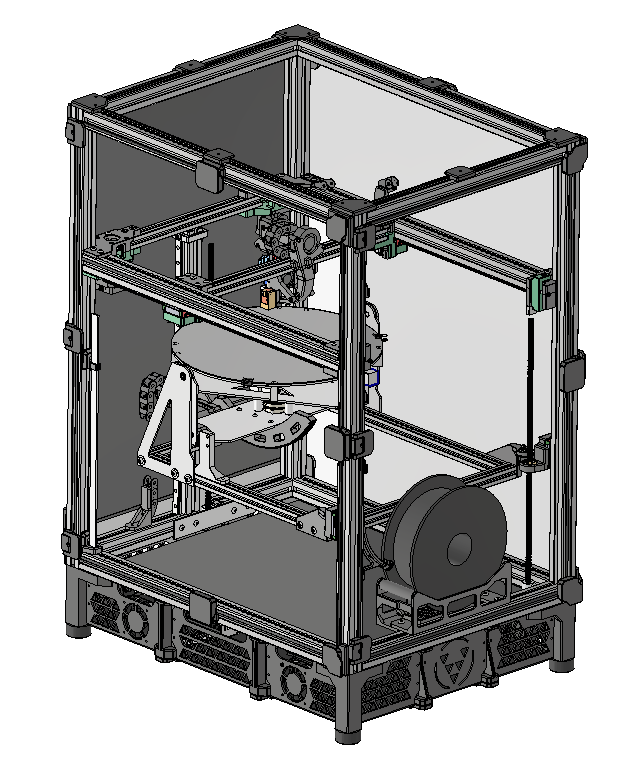

# Fractal 5 Pro

The Fractal 5 Pro is an intuitive benchtop multidirectional 5-axis 3D printer.

It was designed in support of the Fractal Robotics vision: to accelerate the development of mechanical solutions. This printer aims to address the gap between the limitations of 3-axis FDM 3D printing and the accessibility of current 5-axis FDM 3D printing solutions.

  

---

**⚙️Design Features**
- CoreXY Gantry
- Direct Drive Extruder  
- Fully Enclosed
- Rigid 30x30mm aluminum frame extrusions
- Triple Lead-Screw Z Axis  
- Dual Rotary Axis Printing Bed  
  - 300mm Diameter x 250mm Build Height  
  - Heated build plate up to 100°C  
  - Infinite spin rotation about A-Axis  
  - 0°–90° tilt rotation about B-Axis  
  - Removable textured spring-steel build surface
- Compatible with Klipper Firmware

---

**📝Future Work**
- Redesign print bed gimbal for higher rigidity
  - Use 1/4" thick aluminum sheets instead of 1/8"
  - Rearrange A-Axis bearing assembly to minimize unsupported shaft length
  - Incorporate larger corner gussets
- Change A-axis pulley drive to a high ratio gear drive
- Convert cable-chain wire harness system to CAN-bus
- Integrate accelerometer into printhead for input shaping (resonance cancellation)
- Instead of using the inductive probe for centering the print bed, use a sensor that has better defined sensing radii in the X and Y directions
  - The same centering routine can be used, but a different sensor solution is needed
